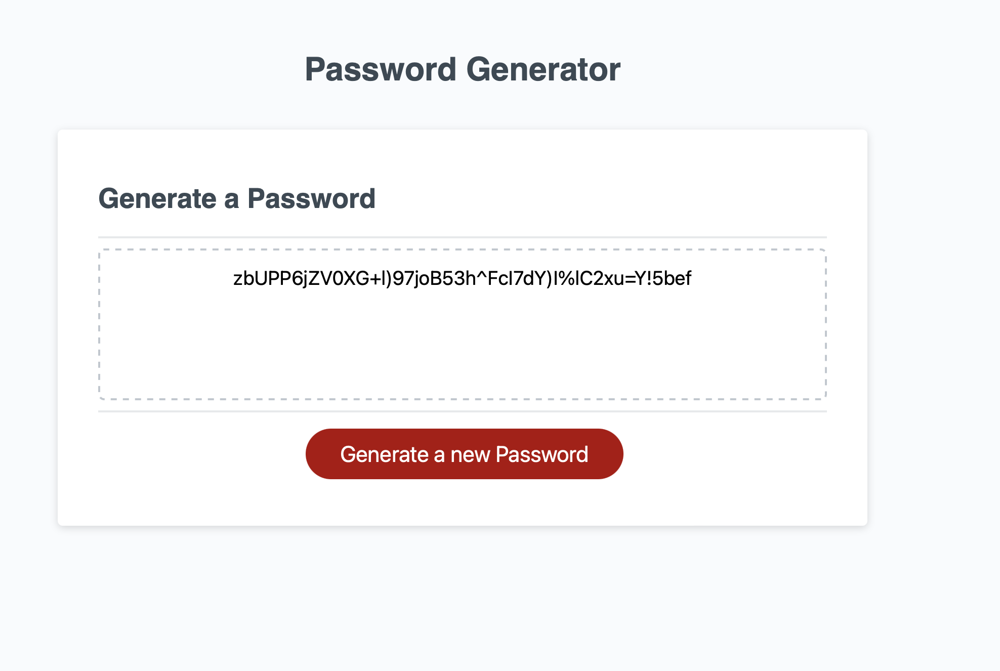

# 03GTBootcamp-Challenge
03 GT BootCamp Challenge - Javascript 

This is the Third challenge for the bootcamp and main objective is to make quality code and the best standards and also trying to do some object programming

## Locations 

Index.html -> Contain all the code that will be processes by the browser to display in the end user display assets -> contain all the formating code (CSS) and pictures that will be displayed in the front end.

## Installation

1. To clone the repository in your computer run this command.

```bash
git clone git@github.com:J28819/03GTBootcamp-Challenge.git

```

2. Then open it with Visual Code and run Live Server on the [Index.html file.]


## Description
This first Challenge was made in Visual code modifying the existing code on the Index.html and Style.css, reducing the clases for similar objects and clean the code as much as I can. 

## Screenshoots



## Conclusion 

It was a great experience works in this project.


## License
[MIT](https://choosealicense.com/licenses/mit/)
